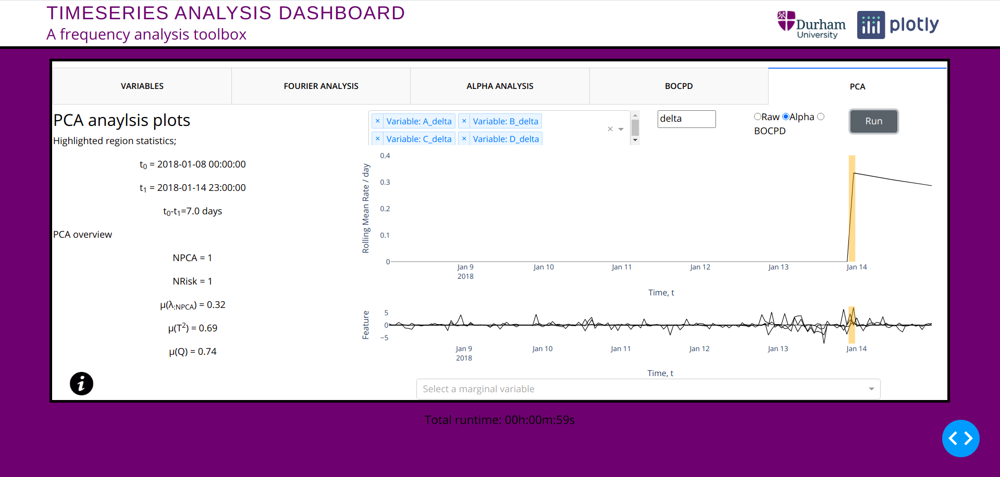

<br />
<p align="center">
  <a href="https://github.com/sephwalker321/DashAnomalyDetection.git">
    
    
  </a>

  <h3 align="center">Anomaly detection dashboard</h3>
</p>


<!-- TABLE OF CONTENTS -->
<details open="open">
  <summary>Table of Contents</summary>
  <ol>
    <li>
      <a href="#about-the-project">About The Dashboard</a>
      <ul>
        <li><a href="#built-with">Built With</a></li>
      </ul>
    </li>
    <li>
      <a href="#getting-started">Getting Started</a>
      <ul>
        <li><a href="#prerequisites">Prerequisites and Installation</a></li>
      </ul>
    </li>
    <li><a href="#usage">Usage</a></li>
    <li><a href="#license">License</a></li>
    <li><a href="#contact">Contact</a></li>
    <li><a href="#acknowledgements">Acknowledgements</a></li>
  </ol>
</details>


<!-- ABOUT THE PROJECT -->
## About The Project

<p align="center">
  <a href="https://github.com/sephwalker321/DashAnomalyDetection.git">
    
  </a>
</p>


The Dashboard is designed to detect anomalous datapoints in complex timeseries and provide quick insight through meaningful plots.

### Built With

The Dashboard was constructed using the following libraries and tools,
* [Dash](https://plotly.com/dash/)
* [Bootstrap](https://getbootstrap.com/)
* [Python](https://www.python.org/)


<!-- GETTING STARTED -->
## Getting Started

To get a local copy up and running follow these simple example steps.

### Prerequisites and Installation

This is an example of how to list things you need to use the software and how to install them.
1. Clone the repo,
   ```
   git clone https://github.com/sephwalker321/DashAnomalyDetection.git
   ```

2. Running the install script,
  Linux:
  ```
  ./install_Linux.sh
  ```
  Windows:
  ```
  install_Windows.bat
  ```

3. Source the virtual environment,
  Linux:
  ```
  source venv/bin/activate
  ```
  Windows:
  ```
  venv\Scripts\activate
  ```
Alternatively see *requirements.txt* and install manually. 
<!-- USAGE EXAMPLES -->
## Usage
To run place .xlsx files in data/RawData then run the python script.
1. Run,
   ```
   python app.py
   ```

Demo data can be generated with,
1. 
  ```
  python DemoDat.py 
  ```
Then the generated .xlsx files can be moved into data/RawData. This is done automatically with the install script.
Details about tabs,

*  *Variables*
  
  Plots up to 6 features located in data/RawData. Slider highlights and updates statistics on the left hand side of the plot. Radio select "Rescale" mean centers all plotted data.
* *Fourier Anaylsis*

  Demo tab showcasing the anaylsis leading to the alpha anaylsis in the following tab. It's possible to play around with the window size and locaion using the slider. In the upper plot the power spectrum is displayed and fitted. With key statistics on the left.
* *Alpha Anaylsis*

  Run the Alpha anaylsis on individual features by clicking run in the upper right corner or alternatively click in the lower corner to run on all.
* *BOCPD Anaylsis*

  Bayesian Online Change Point Detection. Run on individual features by clicking run in the upper right corner or alternatively click in the lower corner to run on all.
* *PCA Anaylsis*

  Run the PCA anomaly detection algorithum on data/RawData, data/AlphaData or data/BOCPDData. Only possible to select combinations that have been generated by running the previous tab anaylsis. 

To remove all files and cached results run,
   ```
   python app.py -D
   ```
   
  

<!-- LICENSE -->
## License

Distributed under the MIT License. See `LICENSE` for more information.


<!-- CONTACT -->
## Contact

For any issues or questions contact Joseph Walker at j.j.walker@durham.ac.uk.


Project Link: [https://github.com/sephwalker321/DashAnomalyDetection.git](https://github.com/sephwalker321/DashAnomalyDetection.git)


<!-- ACKNOWLEDGEMENTS -->
## Acknowledgements

This dashboard was built under the supervision and support of Dr. Andrew Petts, Prof. Frank Krauss, Prof. Richard Bower and the University of Durham.


The tools developed are based on various academic works;
  * BOCPD: 
    * [Bayesian Online Changepoint Detection](https://arxiv.org/abs/0710.3742) 
  * CPs:
    * [An Evaluation of Change Point Detection Algorithms](https://arxiv.org/abs/2003.06222) 
    * [Change Point Detection for Compositional Multivariate Data](https://arxiv.org/abs/1901.04935)
  * PCA: 
    * [Principal Component Analysis For Fault Detection And Diagnosis Experience With A Pilot Plant](https://www.researchgate.net/publication/229022215_Principal_component_analysis_for_fault_detection_and_diagnosis_Experience_with_a_pilot_plant),
    * [Fault Detection Using Principal Component Anaylsis PCA In A Wastewater Treatment Plant](https://www.researchgate.net/publication/228473640_FAULT_DETECTION_USING_PRINCIPAL_COMPONENT_ANALYSIS_PCA_IN_A_WASTEWATER_TREATMENT_PLANT_WWTP)
    * [Overview of PCA Based Statistical Process Monitoring Methods for Time Dependent High Dimensional Data](https://www.researchgate.net/publication/281845999_Overview_of_PCA-Based_Statistical_Process-Monitoring_Methods_for_Time-Dependent_High-Dimensional_Data)
